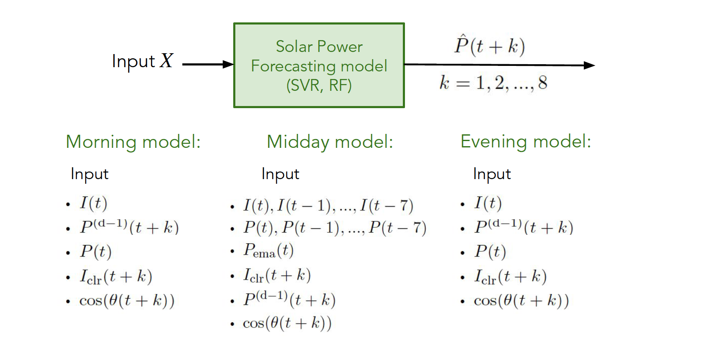

# A Comparison of intraday solar power forecasting methods

by
Sararut P.,
Chayanont P.,

This paper has been submitted for presentation in *2102499: Electrical Engineering Project*.

> This study is divided into two parts: to study the relevant variables of intraday solar irradiance foresting (clear sky model), and to compare forecasting models including `Linear regression`, `MARS`, `ANN` (baseline model), `SVR`, `Random forest` (proposed model).

figure above show an example of the forecast configuration in this paper
## Abstract

Intraday solar power forecasting is crucial to ensuring power continuity and economical dispatch in PV systems.
This study is focused on an `4-hour ahead solar power forecasting` in a resolution of 30 min. We present 2 approaches,
namely, `indirect approach` and `direct approach` which are forecasting solar power via irradiance prediction and PV
conversion and forecasting solar power directly respectively. The proposed models for the two approaches are split
and responsible for providing predictions at three different times of the days: morning, midday, and evening. In this
work, we develop SVR and RF models and compare the performance to baseline models which are linear regression,
MARs and ANN models. All models are designed to produce intraday solar power forecasts using ground data which
were collected from two measurement stations in central region of Thailand from 2017-2018. The result shows that the
direct approach yielded better performance, achieving NRMSE of 7.14% and 6.93%, compared to the indirect approach
which achieved NRMSE of 6.40% and 6.02% on `SVR` and `RF` model respectively. The best model in terms of forecast
accuracy is achieved by the random forest model that directly predicts solar power.

## Methodology
### Clear sky model
A clear sky models estimates the terrestrial solar radiation under a **cloudless sky** as a function of the solar elevation angle and various atmospheric conditions. the estimated irradiance can be use as a `predictor` in intraday solar irradiance forecasting. The clear sky detection algorithm was proposed since some clear sky models need measurement data to estimate the coefficinet in the equation. the clear sky models and detection algorithm were written in matlab, python (ipynb) respectively which can be found in `code/clearsky_model` folder

### Forecasting approach
1. `indirect approach`:  forecasting solar power via irradiance prediction and PV conversion

2. `direct approach`:  forecasting solar power directly respectively.

the experiments in this 2 approaches can be found in `code/forecasting_model` folder and to get in detail you can read on `documentation/intraday_report`

## Acknowledgement
This study would not have been possible without the support of our advisor: Assist. Prof. Jitkomut Songsiri , family and friends. The dataset in this study was supported by Smart Grid Research Unit (SGRU) at chulalongkorn university. 
